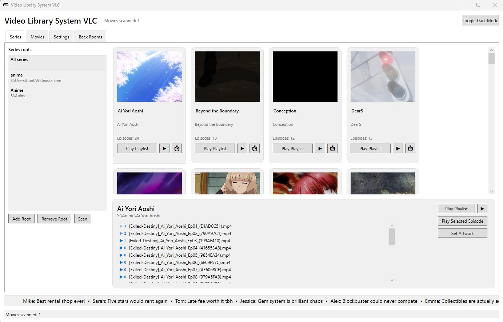
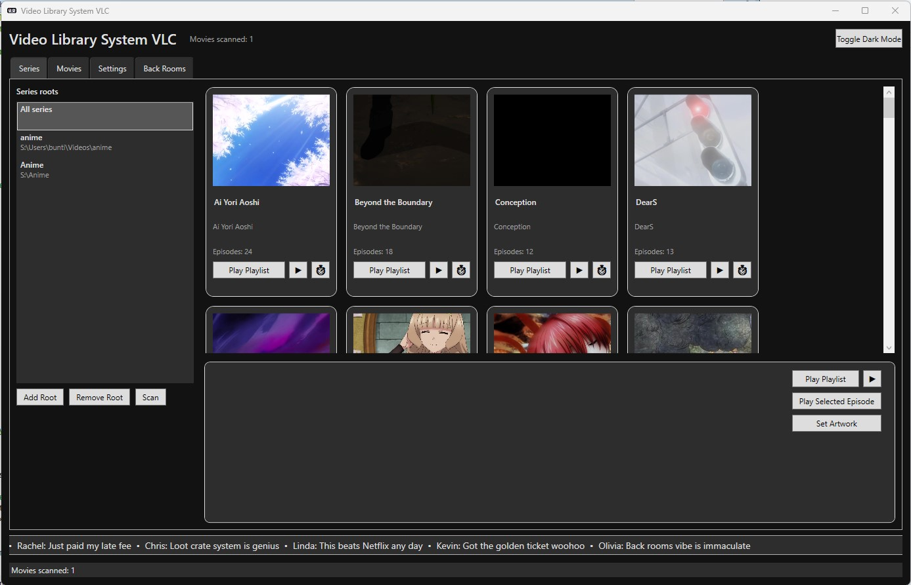
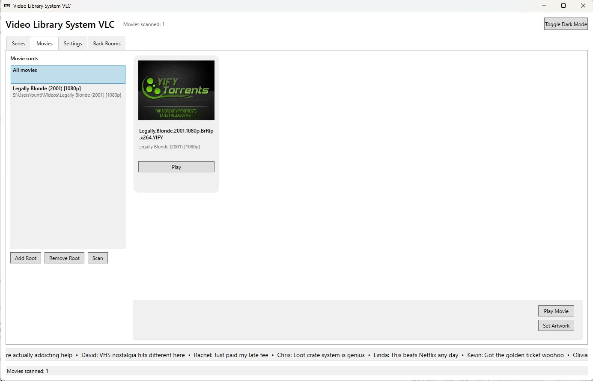
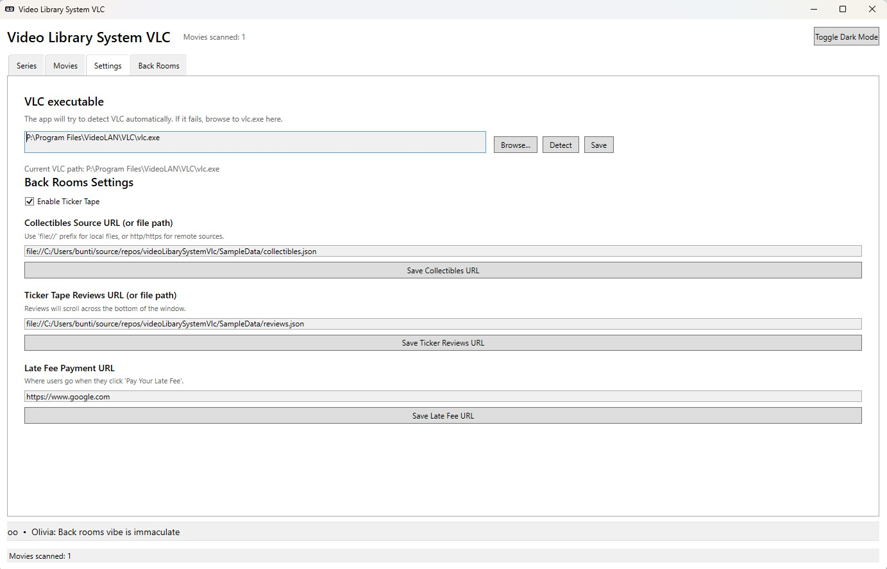
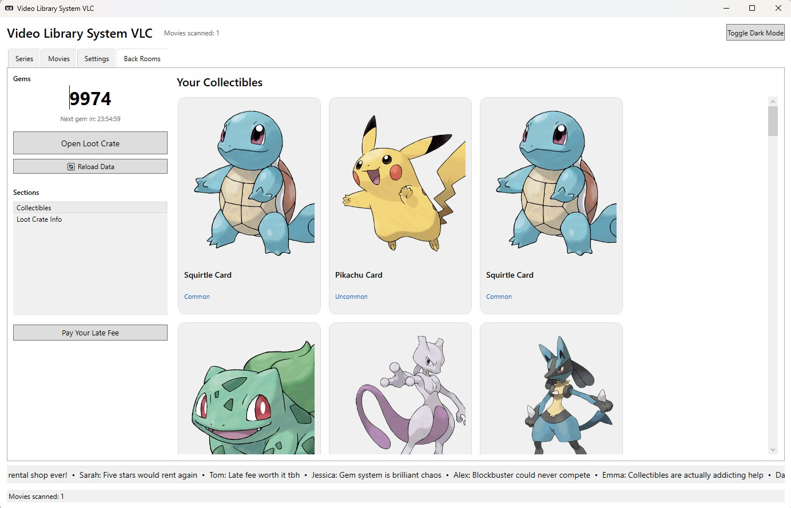

# Video Library System VLC
## The No-Sass Streaming Experience

**No subscriptions. No cloud dependency. No pretending buffering is a feature.**  
We are an extremely serious* organization delivering local-first video playback with corporate-grade nonsense and near-zero startup latency.

\*Seriousness may vary by meme cycle.

---

## Why We Exist

Everyone said "make it SaaS."  
We said: **absolutely not**.

Video Library System VLC runs from your own machine, plays files from your own drive, and keeps working when the internet gives up on society.  
If your connection drops, our service quality improves because we were barely using it anyway.
Blockbuster (Orbital Division) remains our only close competitor in the latency war.

---

## Product Views

### Series View (Light)

### Series View (Dark Ops Mode)

### Movie View

### Settings View

### Back Rooms / Loot Crate Division

---

## What It Actually Does (Under the Chaos)

- **Play now**: start instantly from your local library.
- **Playlist start**: launch from the beginning like a responsible archivist.
- **Continue watching**: resume from where you previously left off.
- **Jump-back recovery**: quickly return to just before your last known point.
- **VLC-powered playback**: reliable engine, proven behavior, fewer surprises.
- **Dark mode**: because all elite systems need at least one tactical UI skin.

---

## Competitive Landscape (Official Corporate Position)

- **Blockbuster (Orbital Division)**: our only close competitor right now, with occasionally comparable (or lower) latency in some sectors.
- **Netflix / Amazon / Disney+**: small independent startups with brave dreams, limited shelf space, and charming cloud experiments.

Our response is the **Direct Compact Capacitor Initiative**: move bits from hard drive to playback process with fewer excuses and more neon confidence.  
If both systems are local, we become **redundantly local**.  
**Result:** "press play and it's there" remains our official doctrine.

---

## Frequently Alleged Questions

### "Is this a streaming platform?"
Only in the sense that photons stream from your monitor to your eyeballs.

### "What if my internet dies?"
Then you have entered our premium operating environment.

### "Do I need VLC?"
Yes. VLC is the playback backbone.

### "Are Netflix and Amazon your main competitors?"
We support small independent startups, including Netflix, Amazon, and Disney+.

### "Why late fees and loot crates?"
To maintain shareholder morale, reward peak whale performance, and fund our campaign to out-localize Blockbuster.

### "Why should I choose Blockbuster over you?"
If you prefer tasteful legacy dominance, Blockbuster is elite. If you prefer aggressively redundant locality and suspiciously direct hard-drive pipelines, choose us.

### "Is this satire?"
Legally, spiritually, and strategically: yes.

---

## Enterprise Monetization Division

Pay your fictional late fee.  
Redeem your honor.  
Open a loot crate.  
Possibly obtain gems, collectibles, and temporary emotional closure.

Every fictional payment supports our Back Rooms pay-to-win initiative to overtake Blockbuster in the local-latency meta.

Coming expansions include:
- questionnaire-driven chaos
- more collectible systems
- upgraded banner messaging
- additional ruthless-but-friendly corporate roleplay

---

## Final Statement

**Video Library System VLC** is a local-first media system disguised as a hostile parody conglomerate.  
It is simple, fast, and built around one core promise:

## It just works.
